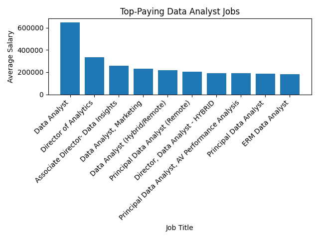

# Data Analyst Job Market Analysis 2023

# Introduction
This project delves into the 2023 data analyst job market, uncovering the hottest skills, top-paying jobs, and salary trends 📊. Whether you're aiming to enter the field or boost your career, this analysis provides the insights you need to make strategic choices 🚀.  Using a unique dataset of 2023 job postings, discover the skills that will give you an edge and find out where the most lucrative opportunities lie 💰.

🔍 SQL queries? Check them out here: [project_sql folder](/project_sql/)

# Background
In today's data-driven world, skilled data analysts are essential for making informed business decisions 📈.  This project was inspired by my curiosity about the specific skills and areas within data analysis that offer the most promising career opportunities. By analyzing job posting data, we can gain valuable insights into current market trends.
 

### Key Questions this Project Addresses:
1. What are the top-paying data analyst jobs and their corresponding salaries?
2. What skills are required for these top-paying jobs?
3. Which skills are most frequently sought after by employers?
4. What are the top-paying skills for data analysts?
5. Which skills offer the best balance of high demand and competitive salary?

# Tools I Used

- **PostgreSQL**: Used to store and manage the extensive job posting dataset.
- **SQL**: Employed to write complex queries for extracting trends, skill demands, and salary insights from the data.
- **VS Code**: Provided a streamlined environment for writing and refining SQL queries.
- **Git**: Enabled secure tracking of code changes and facilitated project versioning.
- **GitHub**: Served as the repository for the project, allowing for easy storage, sharing, and potential collaboration.
# The Analysis

### Query 1: Top-Paying Data Analyst Jobs
**Query Description:**
Identifies Data Analyst jobs with the highest average salaries, focusing on positions offering remote work ("Anywhere" location).


```sql
SELECT
    job_id,
    job_title,
    job_location,
    job_schedule_type,
    salary_year_avg,
    job_posted_date,
    name AS company_name
FROM
    job_postings_fact
LEFT JOIN company_dim ON job_postings_fact.company_id=company_dim.company_id
WHERE
    job_title_short='Data Analyst' AND
    job_location='Anywhere' AND
    salary_year_avg IS NOT NULL
ORDER BY
    salary_year_avg DESC
LIMIT 10;
```
**Breakdown of Findings:**
- Leadership positions, such as "Director of Analytics," consistently lead to the most lucrative salaries.
- Companies like Meta and AT&T appear heavily invested in attracting top remote data analyst talent.
- The right company fit can significantly impact earning potential, even for entry-level data analysts.



### Query 2: Top-Paying Job Skills
**Query Description:**
Reveals the skills most frequently associated with high-paying Data Analyst positions.

```sql
SELECT
    top_paying_job.*,
    skills
FROM (
    SELECT
        job_id,
        job_title,
        salary_year_avg,
        name AS company_name
    FROM
        job_postings_fact
    LEFT JOIN company_dim ON job_postings_fact.company_id = company_dim.company_id
    WHERE
        job_title_short = 'Data Analyst' AND
        job_location = 'Anywhere' AND
        salary_year_avg IS NOT NULL
    ORDER BY
        salary_year_avg DESC
        LIMIT 10
        ) AS top_paying_job
INNER JOIN skills_job_dim ON top_paying_job.job_id = skills_job_dim.job_id
INNER JOIN skills_dim ON skills_job_dim.skill_id = skills_dim.skill_id
ORDER BY
        salary_year_avg DESC; 
```
**Breakdown of Findings:**

- Proficiency in core data technologies (SQL, Python, R) remains a prerequisite for high-paying positions.
- Cloud expertise (Azure, AWS) significantly boosts earning potential.
- Data visualization skills (Tableau, Power BI) are essential for effectively communicating insights and securing well-compensated roles.


### Query 3: Top Demanded Skills

**Query Description:**
Uncovers the skills most frequently listed in Data Analyst job postings, indicating areas of high market demand.
```sql
SELECT
    skills,
    COUNT(skills_job_dim.job_id) AS demand_count
FROM job_postings_fact
INNER JOIN skills_job_dim ON job_postings_fact.job_id = skills_job_dim.job_id
INNER JOIN skills_dim ON skills_job_dim.skill_id = skills_dim.skill_id
WHERE
    job_title_short = 'Data Analyst'
GROUP BY
    skills
ORDER BY demand_count DESC
LIMIT 10
```
**Breakdown of Findings:**

- Unsurprisingly, SQL dominates as the most in-demand skill for data analysts.

- Excel remains a strong contender, highlighting its continued importance for data manipulation and presentation.

- The high demand for Python suggests a growing emphasis on automation and advanced analytics within the field.


### Query 4: Top-Paying Skills

**Query Description:**
Identifies the specific skills that tend to result in the highest average salaries for Data Analyst positions offering remote work.

```sql
SELECT
    skills,
    ROUND(AVG(salary_year_avg), 0) AS avg_salary
FROM job_postings_fact
INNER JOIN skills_job_dim ON job_postings_fact.job_id = skills_job_dim.job_id
INNER JOIN skills_dim ON skills_job_dim.skill_id = skills_dim.skill_id
WHERE
    job_title_short = 'Data Analyst' AND
    salary_year_avg IS NOT NULL AND
    job_work_from_home = True
GROUP BY
    skills
ORDER BY avg_salary DESC
LIMIT 25
```

**Breakdown of Findings:**

- Niche skills like PySpark and Watson appear to command premium salaries.

- Cloud-related skills (Kubernetes, GCP) continue to be associated with strong compensation.

- Interestingly, proficiency in tools like Jira and Notion indicates a potential premium for analysts who contribute to agile development environments.

### Query 5: Optimal Skills

**Query Description:**
Pinpoints skills that offer the best balance of high demand and competitive salary in the Data Analyst job market.

```sql
WITH skills_demand AS (
    SELECT
        skills_dim.skill_id,
        skills_dim.skills,
        COUNT(skills_job_dim.job_id) AS demand_count
    FROM job_postings_fact
    INNER JOIN skills_job_dim ON job_postings_fact.job_id = skills_job_dim.job_id
    INNER JOIN skills_dim ON skills_job_dim.skill_id = skills_dim.skill_id
    WHERE
        job_title_short = 'Data Analyst'
    GROUP BY
        skills_dim.skill_id, skills_dim.skills  
), average_salary AS(
    SELECT
        skills_dim.skill_id,
        skills_dim.skills,
        ROUND(AVG(salary_year_avg), 0) AS avg_salary
    FROM job_postings_fact
    INNER JOIN skills_job_dim ON job_postings_fact.job_id = skills_job_dim.job_id
    INNER JOIN skills_dim ON skills_job_dim.skill_id = skills_dim.skill_id
    WHERE
        job_title_short = 'Data Analyst' AND
        salary_year_avg IS NOT NULL AND
        job_work_from_home = True
    GROUP BY
        skills_dim.skill_id, skills_dim.skills
)

SELECT
    skills_demand.skill_id,
    skills_demand.skills,
    demand_count,
    avg_salary
FROM
    skills_demand
INNER JOIN average_salary ON skills_demand.skill_id = average_salary.skill_id
WHERE
    demand_count>10
ORDER BY
    demand_count DESC,
    avg_salary DESC
LIMIT 25
```
**Breakdown of Findings:**

- Core Competencies: SQL, Excel, Python, and visualization tools (Tableau, Power BI) remain essential for success, with strong demand and salaries reflecting their importance.
- Cloud Dominance: Skills in Azure, AWS, and Snowflake are associated with high earning potential, emphasizing the increasing shift towards cloud-based data solutions.
- Consider Niche Expertise: While less common, skills like Go demonstrate surprising earning power, potentially indicating lucrative specialization opportunities.
- The Data Science Edge: The presence of R, Spark, and SPSS hints at a growing demand for analysts capable of blending traditional analysis with data science techniques.


# What I Learned

This project was a data adventure, and I came away with some key insights:

- **SQL = My Superpower 🦸‍♀️:** It's amazing how SQL lets you uncover hidden patterns in data!
- **Data Cleaning: The Unsung Hero 🧹:** Dealing with messy data taught me that clean data is the foundation for accurate analysis.
- **Assumptions Challenged 🤯:** I learned not to underestimate core skills like SQL and Excel – they're still in high demand!
- **Visuals Matter 🎨:** Choosing the right graphs helps your data tell a compelling story.
- **Learning by Doing FTW 🙌:** This project solidified my SQL skills and ignited my passion for data analysis.

# Conclusion
This data-driven deep dive confirmed the power of SQL, the surprising staying power of Excel, and the rising importance of cloud skills in the data analyst landscape 📊.  It also ignited my passion for uncovering insights that can shape careers and solve real-world problems!  If you're looking to break into the field, focus on those core skills, and don't be afraid to get your hands dirty with some data cleaning.

***The future of data analysis is bright, and I'm excited to be part of it! 🚀***
